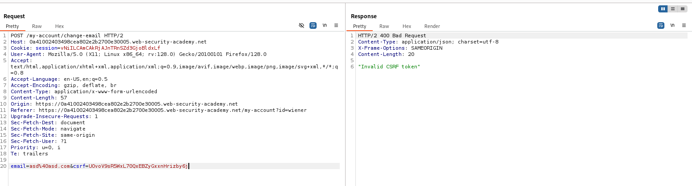

# CSRF LAB 04 - CSRF token is not tied to the user session

## Manual Solution

- Open the Web Security Academy lab environment in your browser.
- Launch Burp Suite and make sure your browser is configured to route traffic through it.
- Log in with the credentials: username:wiener password:peter.
- Navigate to the My Account page and change your email address.
- Observe the POST request sent to the /my-account/change-email endpoint notice that it includes a CSRF token.
- Try changing the email address again. You'll see that the CSRF token has changed.
- This indicates that the CSRF token is not tied to the user session instead, it is regenerated on each request.
- Send the captured POST request to Burp Repeater and attempt to resend it.
- The response returns an error: Invalid CSRF token.

- This error occurs because the application uses a CSRF token pool mechanism. It generates a new token for each request and considers it valid only if it's included in the pool and hasn't been used yet. Each token is singleuse only.
- Navigate to the "My Account" page inspect the page source and copy the CSRF token.
- Go to the Exploit Server and paste the following HTML payload into the body of the page:
```html
    <html>
        <body>
            <form action="https://[YOUR_LAB_ID].web-security-academy.net/my-account/change-email" method="POST">
                <input type="hidden" name="email" value="hacker@hacker.com">
                <input type="hidden" name="csrf" value="[YOUR_TOKEN]">
            </form>

            <script>
                document.forms[0].submit();
            </script>
        </body>
    </html>
```
- Save and deliver the exploit to the victim.
## Automated Solution

### 1. Download the script
### 2. Run the script with the following command:
```sh
python csrf_lab_04.py -u <target_url> -p (if you want to use proxy 127.0.0.1:8080)
```
